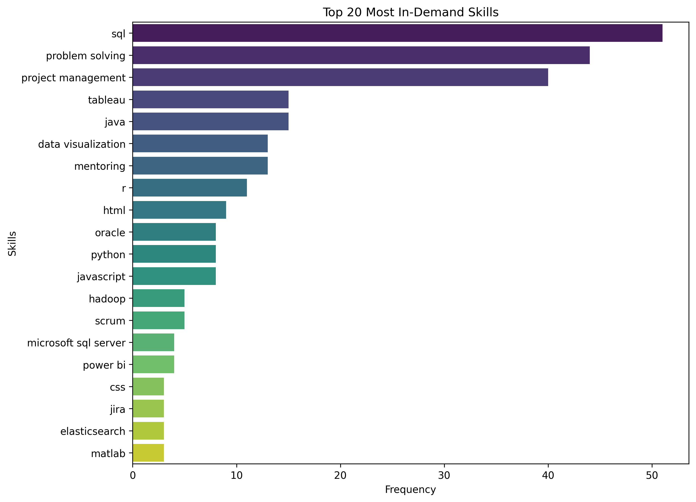
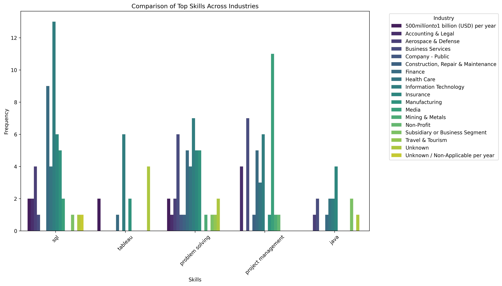

# Job_Skills_Analysis
This project analyzes job descriptions to identify the most in-demand skills across different industries. By leveraging Natural Language Processing (NLP) techniques, we preprocess job postings, extract key skills, and visualize industry-specific skill demands. The goal is to provide actionable insights into the skills that are most sought after in various sectors.

---

## Data Source
This project uses the **Resume-Job-Description-Matching Dataset**, which was shared in the following repository:

[Dutt, B. (2018). Resume-Job-Description-Matching Dataset. GitHub.](https://github.com/binoydutt/Resume-Job-Description-Matching)

## Workflow

### 1. Data Preprocessing
- **Tokenization**: Splitting text into individual words or phrases.
- **Cleaning**: Removing special characters, stopwords, and unnecessary symbols.
- **Lowercasing**: Converting all text to lowercase to ensure consistency.

### 2. Skill Extraction
- **Curated Skill List**: A predefined list of relevant skills is used to match against job descriptions.
- **spaCy PhraseMatcher**: Utilized to efficiently extract skills from the text.

### 3. Skill Frequency Analysis
- **Skill Counting**: Counting the occurrences of each skill across all job descriptions.
- **Top Skills**: Identifying the top 20 most in-demand skills based on frequency.

### 4. Industry-Based Grouping & Visualization
- **Grouping by Industry**: Job descriptions are categorized by industry (e.g., IT, Healthcare, Finance).
- **Visualizations**: Comparative charts and graphs are created to highlight skill demand variations across industries.

---

## Results
The analysis provides insights into the most frequently mentioned skills in job descriptions and how these demands vary across industries.

### Key Findings:
1. **Top 20 Most In-Demand Skills**  
   

2. **Comparison of Top Skills Across Industries**  
   

These visualizations help identify industry-specific skill trends and inform job seekers and employers about the most valuable skills in the current job market.

---

## Acknowledgments
The inspiration for this project were derived from the **Natural Language Processing (NLP) Workshop** available on YouTube. Special thanks to the creators for their insightful content and practical demonstrations, which guided the development of this project.

**Course Title**: "Natural Language Processing Workshop"  
**Channel Name**: Reza Shokrzad - Data Science & AI  
**YouTube Link**: [(NLP) | NLTK & SpaCy](https://www.youtube.com/watch?v=lDCoqQSc4ZE&list=PLIoM6vIerI9o76lRcFzoAd2XEufjEOT4V&index=2)
